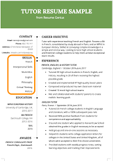
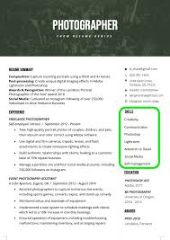
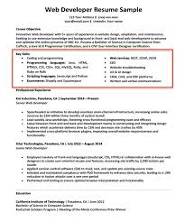

<!DOCTYPE html>
<html>
<head> 
<title>SkillSet</title>

</head>
<body>

<p1>Search for a Skill</p1>
<h1>SkillSet</h1>

<a href="file:///Users/shanwarren/Desktop/SkillSet/Skill%20Areas.html">SkillSet's "Skill Areas"</a>

 

<a href="file:///Users/shanwarren/Desktop/SkillSet/About.html">About</a>

<a1 href="file:///Users/shanwarren/Desktop/SkillSet/Contact.html">Contact (510) 695-5237</a1>
<p1>© 2020 SkillSet</p1>
</body>
</html>

